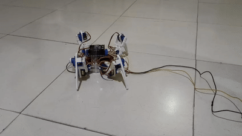

# 🕷️ 4-Legged Crawler Robot

<p align="center">
  <b>A DIY Arduino-based quadruped robot with 12-servo articulated legs and coordinated walking gaits.</b>
</p>

<p align="center">
  Built with ❤️ for robotics, embedded systems, and hands-on experimentation.
</p>

---

## 🎥 Project Demo

<p align="center">
  
</p>

> A four-legged crawler capable of standing, walking forward and backward, turning, waving, shaking hands, and sitting using coordinated servo movements.

---

## 📌 Overview

**4legged-crawler** is a DIY quadruped robot project built around an **Arduino Nano** and **12 servo motors**.

Each of the four legs uses three servo joints:

* **Coxa** — horizontal/hip rotation
* **Femur** — upper-leg movement
* **Tibia** — lower-leg movement

The robot uses coordinated leg trajectories and servo control to generate different movements while maintaining a stable body posture.

The firmware includes predefined motion routines for walking, turning, standing, sitting, waving, and shaking.

---

## ✨ Features

* 🕷️ **4-legged quadruped architecture**
* ⚙️ **12 independently controlled servo motors**
* 🧠 Coordinate-based leg movement
* 🚶 Forward and backward walking
* 🔄 Left and right spot turning
* 🧍 Stand and sit routines
* 👋 Hand-wave movement
* 🤝 Hand-shake movement
* 🎯 Servo calibration support
* ⏱️ Timer-based servo control using `FlexiTimer2`
* 🧩 Modular movement functions
* 🛠️ 3D-printable mechanical parts included
* 🔧 Easy to modify and extend

---

## 🧠 How It Works

The robot has **4 legs × 3 servos = 12 degrees of actuation**.

Each leg is represented as:

```text
        BODY
   ┌─────┼─────┐
   │     │     │
  LEG   LEG   LEG   LEG
   │     │     │
   └─────┴─────┘

Each leg:
     ┌──────────┐
     │  COXA    │  → Horizontal movement
     ├──────────┤
     │  FEMUR   │  → Upper leg movement
     ├──────────┤
     │  TIBIA   │  → Lower leg movement
     └──────────┘
```

The firmware maintains the desired position of each leg in **X, Y and Z coordinates**.

Movement commands modify these target coordinates, while the servo control system gradually moves the joints toward their required positions.

This approach allows complex movements to be constructed from simpler coordinated leg motions.

---

## 🤖 Supported Movements

The current firmware demonstrates the following sequence:

| Movement      | Function         |
| ------------- | ---------------- |
| 🧍 Stand      | `stand()`        |
| 🚶 Forward    | `step_forward()` |
| 🔙 Backward   | `step_back()`    |
| ↩️ Turn Left  | `turn_left()`    |
| ↪️ Turn Right | `turn_right()`   |
| 👋 Wave       | `hand_wave()`    |
| 🤝 Shake      | `hand_shake()`   |
| 🪑 Sit        | `sit()`          |

The default demonstration sequence continuously cycles through these movements.

---

## 🔩 Hardware

### Main Components

| Component                         |    Quantity |
| --------------------------------- | ----------: |
| Arduino Nano                      |           1 |
| Servo Motors                      |          12 |
| Quadruped mechanical frame        |           1 |
| Servo brackets / 3D printed parts | As required |
| External servo power supply       |           1 |
| Jumper wires                      | As required |

### Servo Configuration

Each leg contains three servos:

```text
Leg 0 → Coxa + Femur + Tibia
Leg 1 → Coxa + Femur + Tibia
Leg 2 → Coxa + Femur + Tibia
Leg 3 → Coxa + Femur + Tibia
```

> ⚠️ **Important:** Do not attempt to power all 12 servos directly from the Arduino Nano's 5V pin. Use an appropriate external power supply for the servos and connect the grounds together.

---

## 🔌 Servo Pin Connections

The current firmware uses the following Arduino Nano digital pins:

| Leg       | Coxa | Femur | Tibia |
| --------- | ---: | ----: | ----: |
| **Leg 0** |   D2 |    D3 |    D4 |
| **Leg 1** |   D5 |    D6 |    D7 |
| **Leg 2** |   D8 |    D9 |   D10 |
| **Leg 3** |  D11 |   D12 |   D13 |

This mapping is also documented in [`4legged-crawler-connections.txt`](./4legged-crawler-connections.txt).

### Connection Concept

```text
                    Arduino Nano
                 ┌─────────────────┐
                 │                 │
          D2 ────┤ Leg 0 - Coxa    │
          D3 ────┤ Leg 0 - Femur   │
          D4 ────┤ Leg 0 - Tibia   │
                 │                 │
          D5 ────┤ Leg 1 - Coxa    │
          D6 ────┤ Leg 1 - Femur   │
          D7 ────┤ Leg 1 - Tibia   │
                 │                 │
          D8 ────┤ Leg 2 - Coxa    │
          D9 ────┤ Leg 2 - Femur   │
         D10 ────┤ Leg 2 - Tibia   │
                 │                 │
         D11 ────┤ Leg 3 - Coxa    │
         D12 ────┤ Leg 3 - Femur   │
         D13 ────┤ Leg 3 - Tibia   │
                 │                 │
                 └─────────────────┘

          External Servo Power Supply
                 ┌─────────────┐
                 │   5V Supply │
                 └──────┬──────┘
                        │
                 Servo VCC / GND

             Arduino GND ───────── Servo GND
```

**Common ground is required** between the Arduino and the servo power supply.

---

## 💻 Software Requirements

### Arduino IDE

Install the latest suitable version of the Arduino IDE.

### Required Libraries

The project uses:

```cpp
#include <Servo.h>
#include <FlexiTimer2.h>
```

`Servo.h` is commonly available with the Arduino IDE for supported Arduino boards.

Install **FlexiTimer2** through the Arduino Library Manager or add the library manually.

---

## 🚀 Getting Started

### 1. Clone the Repository

```bash
git clone https://github.com/gourab354/4legged-crawler.git
cd 4legged-crawler
```

### 2. Open the Firmware

Open:

```text
main.ino
```

in the Arduino IDE.

### 3. Select the Board

In Arduino IDE:

```text
Tools → Board → Arduino Nano
```

Select the appropriate processor option for your Nano if required.

### 4. Select the COM Port

Connect the Arduino Nano and select:

```text
Tools → Port → <Arduino Nano Port>
```

### 5. Install Dependencies

Make sure the required libraries are installed:

```text
Servo
FlexiTimer2
```

### 6. Upload

Upload `main.ino` to the Arduino Nano.

After initialization, the robot will execute its programmed movement sequence.

---

## 🎯 Servo Calibration

Before running the complete walking program, properly calibrate the servo positions.

The repository includes:

```text
servo-calibration.ino
```

Use this sketch to determine suitable neutral positions for the servos.

### Calibration is important because:

* Servo mounting angles can vary.
* Mechanical tolerances affect leg symmetry.
* Different servo models may have slightly different center positions.
* Incorrect calibration can cause unstable movement or mechanical stress.

After calibration, update the relevant servo offsets/angles in the main firmware.

---

## 🧩 Project Structure

```text
4legged-crawler/
│
├── 3d-parts-4legged crawler/
│   └── 3D printable/mechanical parts
│
├── 4legged-crawler-connections.txt
│   └── Arduino Nano pin connection reference
│
├── 4legged-crawler.gif
│   └── Project demonstration
│
├── main.ino
│   └── Main quadruped robot firmware
│
├── servo-calibration.ino
│   └── Servo calibration utility
│
└── README.md
    └── Project documentation
```

---

## ⚙️ Firmware Architecture

The firmware is organized around a few important layers:

```text
             ┌──────────────────────┐
             │   Movement Commands  │
             │                      │
             │  Walk / Turn / Sit   │
             │  Stand / Wave / etc. │
             └──────────┬───────────┘
                        │
                        ▼
             ┌──────────────────────┐
             │  Leg Position System │
             │                      │
             │    X / Y / Z target  │
             └──────────┬───────────┘
                        │
                        ▼
             ┌──────────────────────┐
             │   Motion Calculation │
             │                      │
             │ Joint angle mapping  │
             └──────────┬───────────┘
                        │
                        ▼
             ┌──────────────────────┐
             │    Servo Control     │
             │                      │
             │      12 Servos      │
             └──────────────────────┘
```

The firmware also uses `FlexiTimer2` to periodically run the servo service, allowing the movement system to update the servos at regular intervals.

---

## 🔬 Robot Dimensions & Motion Parameters

The firmware contains configurable mechanical and movement parameters such as:

```cpp
length_a
length_b
length_c
length_side

x_default
y_start
y_step

z_default
z_up
z_boot
```

These parameters represent the geometry and working positions used by the leg movement calculations.

This makes it possible to adapt the firmware to a different mechanical design by modifying the relevant dimensions and motion parameters.

---

## 🛠️ Customization

You can modify the project to create your own movement patterns.

For example:

```cpp
stand();

step_forward(5);

turn_left(5);

step_back(5);

turn_right(5);

hand_wave(3);

hand_shake(3);

sit();
```

You can also change the number of steps:

```cpp
step_forward(10);
```

or modify movement speeds and leg positions in the firmware.

---

## 🧪 Example Motion Sequence

The default firmware performs approximately:

```text
START
  │
  ▼
Initialize Robot
  │
  ▼
Stand
  │
  ▼
Walk Forward
  │
  ▼
Walk Backward
  │
  ▼
Turn Left
  │
  ▼
Turn Right
  │
  ▼
Wave
  │
  ▼
Shake
  │
  ▼
Sit
  │
  ▼
Repeat
```

This makes the robot suitable for demonstrations and testing individual gait routines.

---

## 🔧 Troubleshooting

### Robot is moving incorrectly

Check:

* Servo horn alignment
* Servo calibration
* Leg assembly orientation
* Servo pin mapping
* Mechanical symmetry

---

### Some servos are not moving

Check:

* Servo power supply
* Common GND between Arduino and servo supply
* Servo signal wire
* Pin configuration in `main.ino`
* Servo connections

---

### Arduino resets when several servos move

This is commonly related to insufficient servo power.

**Do not power a 12-servo system directly from the Arduino Nano.**

Use a suitable external servo power supply capable of handling the required current.

---

### Robot is unstable

Check:

* Servo calibration
* Center positions
* Mechanical balance
* Body weight distribution
* Walking speed
* Leg geometry

Reducing movement speed can also help during initial testing.

---

## 🚧 Current Limitations

The current firmware is primarily a **pre-programmed motion demonstration**.

The robot currently executes predefined movement routines from the Arduino program rather than using sensors for real-time environmental feedback.

There is also no autonomous obstacle avoidance or balance feedback system in the current implementation.

---

## 🚀 Future Improvements

Possible upgrades include:

* 📱 Bluetooth / wireless remote control
* 🎮 Mobile controller
* 🧭 IMU-based orientation sensing
* 🚧 Ultrasonic obstacle detection
* 🧠 Autonomous navigation
* ⚖️ Dynamic balance control
* 📷 Computer vision
* 🗺️ Mapping and path planning
* 🔋 Battery monitoring
* 🎯 More advanced gait algorithms
* 🤖 Semi-autonomous movement
* 📡 Wi-Fi-based control
* 🦿 Improved inverse-kinematics control
* 🧠 Sensor-fusion based locomotion

---

## 📚 Learning Objectives

This project is useful for learning:

* Embedded C/C++
* Arduino programming
* Servo motor control
* Robotics
* Quadruped locomotion
* Coordinate systems
* Basic kinematics
* Motion planning
* Mechanical design
* 3D printing
* Hardware-software integration

---

## 🤝 Contributing

Contributions, improvements, experiments, and new gait algorithms are welcome.

If you have an idea for improving the crawler:

1. Fork the repository.
2. Create a new branch.
3. Make your changes.
4. Test the robot carefully.
5. Submit a pull request.

For hardware modifications, include photos, wiring information, or CAD files whenever possible.

---

## ⭐ Support the Project

If you find this project interesting or useful:

* ⭐ Star the repository
* 🍴 Fork the project
* 🛠️ Build your own version
* 🐛 Report issues
* 💡 Suggest improvements
* 🤝 Contribute new features

---

## 👨‍💻 Author

**Gourab**

Electronics & Robotics Enthusiast

Interested in:

```text
Robotics • Embedded Systems • Electronics • AI • Hardware
```

---

## 📄 License

No license has currently been specified for this repository.

If you intend to allow others to freely use, modify, and redistribute the project, consider adding an appropriate open-source license.

---

<p align="center">
  <b>Built with Arduino, servos, code, and a lot of mechanical debugging. 🤖</b>
</p>

<p align="center">
  <i>Make it move. Make it smarter. Make it yours.</i>
</p>
